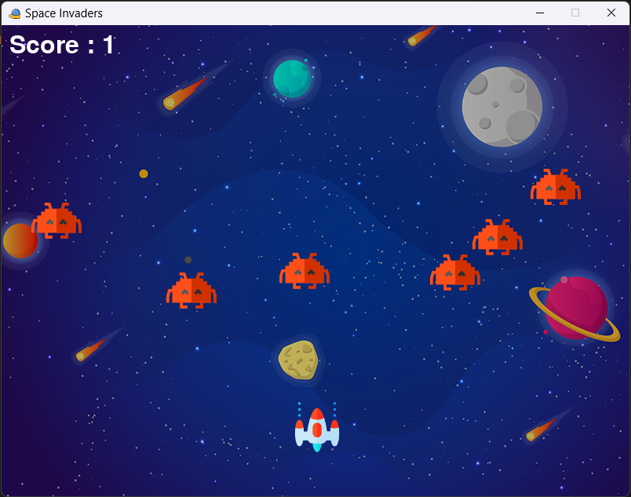

# 🚀 Space Invaders - My First Python Game Project

This is a simple **Space Invaders** game developed using **Python** and **Pygame**.  
It marks my very first complete project, through which I started exploring game development and Python graphics programming.

---

## 🎮 About the Game

In this game, you control a spaceship that can move left or right and fire bullets to destroy incoming enemies.  
The goal is to score as many points as possible by hitting enemies — if they reach the bottom, it's game over!

---

## ✨ Features

Along with the basic gameplay, I’ve added several new features to enhance the experience:

- 🔁 **Restart button** after Game Over  
- 📂 **High Score system** (stored in a file)  
- 🎵 **Custom Game Over sound**  
- 🎶 **Background music and sound effects**

---

## 🕹️ Controls

- **Left Arrow** – Move Left  
- **Right Arrow** – Move Right  
- **Spacebar** – Fire Bullet (Only one bullet at a time)

---

## 📦 Installation

To run this game on your machine, make sure you have Python 3 installed.

1. Install dependencies:
   ```bash
   pip install pygame
   ```

2. Clone or download the repository.

3. Run the game:
   ```bash
   python main.py
   ```

---

## 🖼️ Screenshot




---

## 🙌 Final Note

I had a lot of fun building this project and learning how to work with **Pygame**, file handling, sound effects, and basic game logic.  
This project helped me take my first step into coding interactive games — and it’s just the beginning!

---

## 📁 Project Structure

```bash
.
├── main.py
├── scripts/
│   ├── loader.py
│   └── Data.txt
├── assets/
│   └──images/
│      ├── player.png
│      ├── enemy.png
│      ├── bullet.png
│      ├── background.png
│      ├── restart.png
│   └── sounds/
├── screenshot.png
└── README.md
```

---

Feel free to try out the game or explore the code. Feedback is always welcome!
